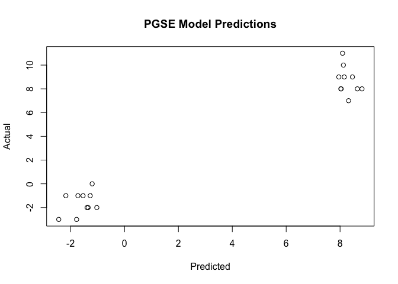
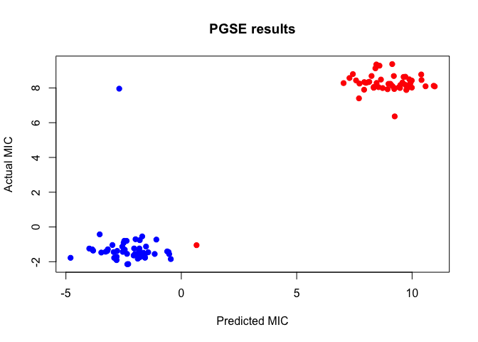

<!-- README.md is generated from README.Rmd. Please edit that file -->

# PGSE R package

<!-- badges: start -->

[](https://github.com/yinzheng-zhong/PGSE/actions/workflows/R-CMD-check.yaml)
<!-- badges: end -->

The goal of PGSE is to …

## Installation

You can install the development version of PGSE from
[GitHub](https://github.com/) with:

``` r
install.packages("devtools")
devtools::install_github("yinzheng-zhong/PGSE", ref="r-package", subdir = "R-package")
```

## Examples

### Model Training

``` r
library(PGSE)
library(MIC)
#> 
#> Attaching package: 'MIC'
#> The following object is masked from 'package:base':
#> 
#>     table
set.seed(42)
# create example genomes, each with length 1000. Odd genomes have the following
# specific gene ACATGAGTACCAAAAA, which is associated with a high MIC
# The even genomes have a low MIC
genomes <- list()
n <- 100
for (i in 1:n) {
  genome <- sample(c("A", "C", "G", "T"), 1000, replace = TRUE)
  if (i %% 2 == 1) {
    genome[1:12] <- c("A", "C", "A", "T", "G", "A", "G", "T", "A", "C", "C", "A")
  }
  genomes[[i]] <- paste(genome, collapse = "")
}

# write to tmp files
tmp_files <- list()
for (i in 1:n) {
  tmp_file <- tempfile(pattern = paste0("genome_", i, "_"), fileext = ".fna")
  writeLines(paste0(">genome_", i, "\n", genomes[[i]]), con = tmp_file)
  tmp_files[[i]] <- tmp_file
}

# create labels
labels <- ifelse((1:n) %% 2 == 1, ">256", "0.25")

# data prep for the labels
labels <- MIC::mic_uncensor(labels)
labels <- log2(labels)
labels <- labels + rnorm(length(labels), mean = 0, sd = 1)

# shuffle data but keep same order for labels
# create named list
data <- lapply(labels, \(x) x)
names(data) <- tmp_files

# run PGSE
result <- pgse(x = names(data),
               labels = unlist(data))


# plot
plot(result)
```



### Inference/Prediction

``` r
# now, we will use the model to predict the MIC of n new genomes
# create example genomes, each with length 1000. Odd genomes have the following
# specific gene ACATGAGTACCAAAAA, which is associated with a high MIC
new_genomes <- list()
n <- 100
for (i in 1:n) {
  genome <- sample(c("A", "C", "G", "T"), 1000, replace = TRUE)
  if (i %% 2 == 1) {
    genome[1:12] <- c("A", "C", "A", "T", "G", "A", "G", "T", "A", "C", "C", "A")
  }
  new_genomes[[i]] <- paste(genome, collapse = "")
}

# write to tmp files
tmp_files <- list()
for (i in 1:n) {
  tmp_file <- tempfile(pattern = paste0("genome_", i, "_"), fileext = ".fna")
  writeLines(paste0(">genome_", i, "\n", new_genomes[[i]]), con = tmp_file)
  tmp_files[[i]] <- tmp_file
}

# create labels
labels <- ifelse((1:n) %% 2 == 1, ">256", "0.25")
# data prep for the labels
labels <- MIC::mic_uncensor(labels)
labels <- log2(labels)
labels <- labels + rnorm(length(labels), mean = 0, sd = 1)

# no need to shuffle
# create named list
data <- lapply(labels, \(x) x)
names(data) <- tmp_files
# run predictions
preds <- predict(result,
                 names(data))

# plot
plot(preds ~ labels,
     xlab = "Predicted MIC",
     ylab = "Actual MIC",
     main = "PGSE results",
     pch = 19,
     col = ifelse(labels > 0, "red", "blue"))
```


